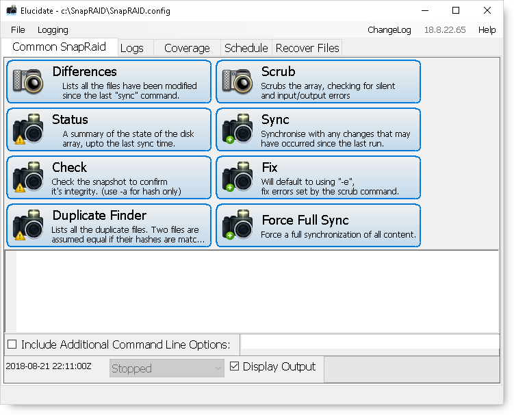
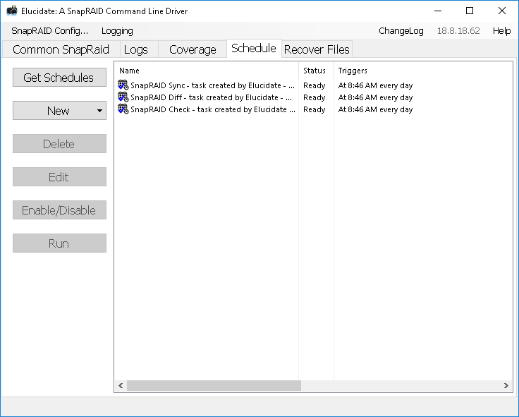

# Elucidate

- [Project Description](#project-description)
- [System Requirements:](#os-requirements)
- [FAQs](#faqs)
- [roadmap](#roadmap)
- [Screenshots](#screenshots)

## Project Description

Elucidate is a Windows GUI front-end for the command-line SnapRAID application.

*This project is continues the amalgamation of the great work done by myself and other contributors.

## System Requirements

- Windows Operating System
- .Net Runtime 4.7.2 or higher
- SnapRaid Version 11.3 or lower
- 10MB Free Space on target drive

## FAQs

**Q**: What is SnapRAID? 
**A**: SnapRAID is a software-defined snapshot-parity engine for Windows and Linux operating systems. On the most basic level, it offers protection to the contents of a file-system under its umbrella by computing the hashes of its component files and storing the results on a parity file. In the event of a complete hard drive failure, this parity file can be used to reconstruct the lost data. For full detail, visit SnapRAID's [official comparison of file protection engines.](http://snapraid.sourceforge.net/compare.html)

**Q**: Why a GUI, the Command Line works! 
**A**: The larger goal is to create a feature-complete GUI with additional management features designed to aid a user in maintaining a functioning SnapRAID environment. Sometimes, ‘point and clicks’ are easier for a novice to get going with. SnapRAID's technical documentation and deep configurability can make adopting it off-putting to those looking to try it out!

**Q**: I'm still uncertain, is there more ? 
**A**: Yes, Have a look at the [documentation](./docs/Documentation.md) for pictures etc.

**Q**: So what are the "Larger Goals" ? 
**A**: See the __Roadmap__ below for a complete breakdown.

## Roadmap

- [x] Phase I
  - [x] Attempt to keep up with the minimum support of the latest SnapRAID. - __On-going.__
  - [x] Ease of use
  - [x] SnapRAID has three commands, so lets make them simple to access for a novice 
  - [x] Progress indicator(s) 
  - [x] Logging "Interactive" and straight to log. 
  - [x] Auto start-up on user login 
  - [x] Tool-tips to guide •	

- [x] Phase II Phase II Feature requests
  - [x] Pause, Change priority, Abort.
  - [x] Command Extension - "Allow extra parameters to the defaults used."
  - [x] Scheduling.
  - [x] Graphical view(s) of the protected data.

- [ ] Phase III (Restart for 17-0x onwards)
  - [x] New Compiler and .Net 4.7.x	
  - [x] Command Line interface
  - [ ] New Layout via Krypton Toolkit / Navigator / etc.
  - [ ] Translations 
  - [x] New Commands
  - [x] Log view(s) diagnostics
  - [ ] Mailer with status reports

- [ ] Phase IV (Recovery and new SnapRAID Commands ?) 
  - [ ] Extended Help with recovery – interactive guides etc.. 
  - [ ] Show what could be recovered (This will require looking into the SnapRaid codebase to interpret the status file(s)). 
  - [ ] Notify the user if their SnapRAID version is outdated
  - [ ] Interpret the SnapRAID logs (used by the changes below)
  - [ ] Provide the status of the array following a command run
  - [ ] Modify the sync command to include an initial diff
  - [ ] Modify the sync command to throw a warning if the diff has reported problems above a threshold
  - [ ] Add user configurable settings for sync threshold requirements
  - [ ] Extended Help with recovery – interactive guides etc..

## Screenshots

## Can you Help ? 
- Looking for testers (All .Net platforms) 
- Can help translate 
- Help / User interface guides 
- Any other ideas :-) 
- Developers for the ideas 
