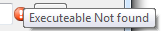
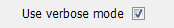
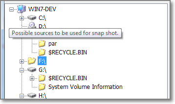
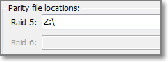

## Index
* [Elucidate user settings](#elucidate-user-settings)
	* [SnapRAID Application location](#snapraid-application-location)
	* [SnapRAID config file location](#snapraid-config-file-location)
	* ["Use verbose"](#use-verbose)
* ["Reset to last config"](#reset-to-last-config)
* ["Save Settings"](#save-settings)
* [SnapRAID config file](#snapraid-config-file)
	* [Possible source Locations.](#possible-source-locations)
	* [Snapshot Sources](#snapshot-sources)
	* [Parity Locations](#parity-locs)
	* [Filter Exclusions](#filter-exclusions)

----

### Elucidate user settings
 
The application attempts to help you by using the flashing error icons. These also have a tool-tip on them giving a brief hint as to what the problem may be.
The settings that are stored are on a per user basis, so the settings can be made common or specific to each logged on users requirements.
_Each area of the window does have tool-tips as a brief reminder of their function._

#### SnapRAID Application location
 
This is required by the GUI application in order to be able to drive it with the commands that you require. It needs to be visible to this current user of this GUI. The Error icon will exist if this application cannot be found.

#### SnapRAID config file location

This is required by the SnapRAID application in order to be able to drive it with the commands that you require. It needs to be visible to this current user of this GUI. The Error icon will exist if this application cannot be found.

#### "Use verbose"

This makes the output from SnapRAID go into verbose mode. All this information is placed into the log file for viewing later.

#### "Reset to last config"

Pressing this button will revert the settings in this window back to the last saved configuration. This is especially useful if you feel you have made a mistake with the order of the protection sources

#### "Save Settings"

Any changes that have occurred in this window, will cause an Error icon to appear next to this button. It is a reminder that those changes will not be used. If the settings do not pass a certain number of internal validation tests, then the Main application will not enable any of it's buttons.

### Snapraid Config File
Parameters affecting the Snapraid Config

#### Possible source Locations

This area shows the current visible items that SnapRAID will be able to protect. To move them over to the protection list you can either double click, or drag and drop. The Drop location will also be the order in which they will be used. Subdirectories can be protected by just expanding the tree and then dragging them.
**It is important that you do not choose the parity location**

#### Snapshot Sources
 
This area shows the currently protected locations. Do not change the order of these once a SnapRAID has been created. The initial order can be changed by dragging and dropping within this area. To remove a location - _before_ protection has been created - just select it and press delete.

#### Parity Locations

SnapRAID has 2 types of snapshot protection, These are _similar_ to Raid 5 and Raid 6, in that 5 protects a single source being removed / corrupted, and Raid 6 protects against 2. These location need to be on different media, and need to be on a disk that can accept large files (i.e. not FAT). The space available @ these locations needs to greater than the largest are that needs to be protected.

#### Filter Exclusions
 
* SnapRAID currently (1.4 onwards) 
	* Ignores in sync System and Hidden files in Windows
	* Files without read permission are ignored in sync.
	* Ignores any symbolic links.
	* Any file that matches the patterns listed in this area
	* Patterns are used to select a subset of files to exclude or include in the process.

Following is taken from the [SnapRAID website](http://snapraid.sourceforge.net/manual.html)

    There are four different types of patterns:
    FILE       - Selects any file named as FILE. You can use any globbing character like * and ?. This pattern is applied only to files and not to directories.
    DIR/       - Selects any directory named DIR. You can use any globbing character like * and ?. This pattern is applied _only to directories_ and not to files.
    /PATH/FILE - Selects the exact specified file path. You can use any globbing character like * and ? but they never matches a directory slash. This pattern is applied only to files and not to directories.
    /PATH/DIR/ - Selects the exact specified directory path. You can use any globbing character like * and ? but they never matches a directory slash. This pattern is applied only to directories and not to files.

    In Windows you can freely use the backslash \ instead of the forward slash /. 

